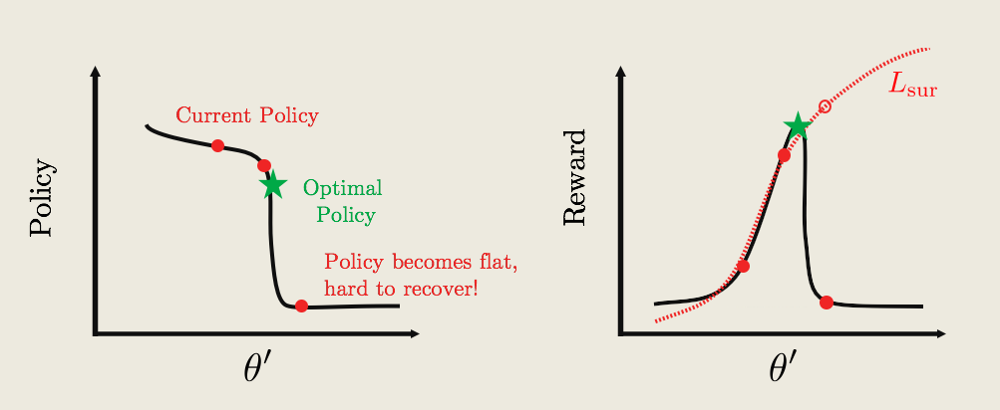
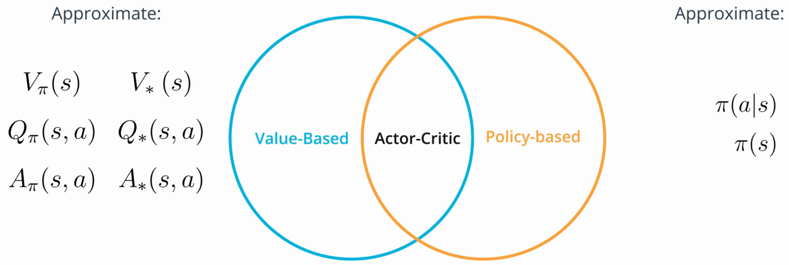
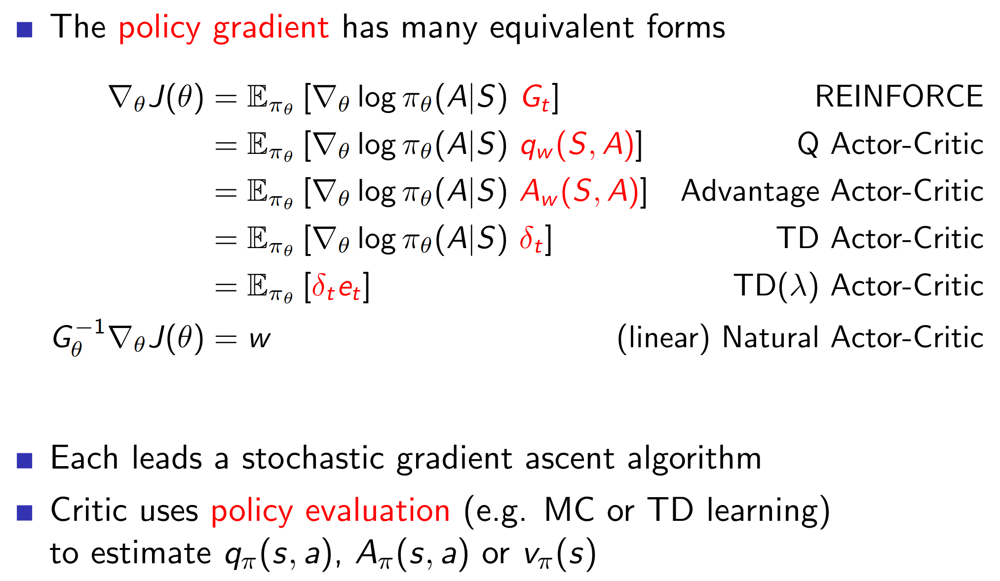

# Reinforcement Learning

## A Taxonomy of RL Algorithms
Reinforcement learning basics and value-based RL algorithms can be found here: https://github.com/AnKra/udacity-deep-reinforcement-learning-navigation-project/blob/master/Report.md

## Policy-Based RL Methods
### Why Policy-Based Methods?
#### Simplicity
Value-based methods maintains an estimate of the optimal action-value function. The optimal policy is derived from this estimate. In contrast, policy-based methods learn the optimal policy directly.

#### Stochastic Policies
In contrast to value-based methods, policy-based methods can learn stochastic policies. In this case, the network outputs are treated as the probability that the agent the corresponding action.

#### Continuous Action-Spaces
Value-based methods require discrete action spaces. In contrast, policy-based methods can be used to solve environments with continuous action spaces.

### Policy Gradient Methods
Policy gradient methods estimate the weights of an optimal policy through gradient ascent.

The so-called REINFORCE algorithm proceeds as follows:
1. Initialize a random policy.
2. Use the policy to collect trajectories (i.e. a sequence of state, actions and rewards).
3. Calculate the total reward of the trajectory. Estimate the gradient of the expected reward.
4. Update the weights of the policy using gradient ascent with a learning rate.
5. Go to step 2

### Proximal Policy Optimization (PPO)
PPO improves the following aspects of the REINFORCE algorithm:

#### Noise
A single collected trajectory may not be representative of the policy. As a consequence, in the gradient estimate in the REINFORCE algorithm is very noisy.

PPO estimates the policy gradient by averaging across a batch of trajectories. This approach reduces noise and increases efficiency.

Another advantage of using batches: Using batches allows for rewards normalization which avoids too large policy updates.

#### Credit Assignment
Some actions in a trajectory may be good while others are bad. The REINFORCE algorithm reinforces actions depending on only the final total output.

PPO assigns credit to an action based on only the future reward. The past reward does not contribute to the policy gradient.

#### Efficiency
A trajectory must be representative for the current policy. Therefore the REINFORCE algorithm uses every trajectory only once.

Importance Sampling allows to reuse trajectories. It is based on the idea that every trajectory has a certain probability to be sampled under the current policy. Under a new policy this probability may be different.

To reused a trajectory its probability needs to be multiplied by a an extra re-weighting factor. This factor corresponds to how more or less representative the trajectory is under the new policy.

#### Clipped Surrogate Function
The idea of PPO is to find a surrogate function which approximates the current policy gradient. In other words, the surrogate function approximates the reward around the current policy. Gradient ascent can be performed by maximizing the surrogate function. (Be aware that this objective is opposed to "classic" deep learning where you aim to find network weights which minimize the error!)

The surrogate function approximates the reward around the current policy well - but further away it might differ significantly from the actual reward.

<figure class="image">
  
  <figcaption>The Policy/Reward Cliff. Source: Udacity Deep Reinforcement Learning Nanodegree</figcaption>
</figure>

To prevent from falling off a cliff and getting stuck in a flat bottom the top part of the surrogate function is flattened.

<figure class="image">
  
  <figcaption>Clipped Surrogate Function. Source: Udacity Deep Reinforcement Learning Nanodegree</figcaption>
</figure>

PPO proceeds as follows:
1. Initialize a random policy.
2. Collect trajectories.
3. Compute the gradient of the clipped surrogate function.
4. Update the policy gradient using gradient ascent.
5. Go to step 3. Loop for a few times.
6. Update the policy and go to step 2.

## Actor-Critic Methods
Actor-Critic methods aim to combine the good aspects of value-based and policy-based methods.

<figure class="image">
  
  <figcaption>Actor-Critic Methods. Source: Udacity Deep Reinforcement Learning Nanodegree</figcaption>
</figure>

The idea is to use value-based techniques to reduce the variance of policy-based methods. The actor decides which action to take. It uses function approximation to learn the optimal policy. The critic evaluates the action. It uses function approximation to learn the estimated value function (in simple implementations the action-value function / Q-value, but typically the state-value function). The critics output is the advantage function. The advantage function tells how good an action is at the current state compared to the other actions. It can be used as a baseline to train the actor. The baseline is subtracted from the policy gradient which reduces variance. One possibility to approximate the advantage function is by TD error.

<figure class="image">
  
  <figcaption>The actor-critic architecture. Source: http://incompleteideas.net/book/first/ebook/node66.html</figcaption>
</figure>

### Advantage Actor Critic (A2C) v.s. Asynchronous Advantage Actor Critic (A3C)
A3C aims to reduce bias by the following improvements:
1. Instead of using a TD estimate, A2C uses an estimate referred to as n-step bootstrapping to train the critic. TD can be seen as a one-step bootstrapping, Monte Carlo as an infinite bootstrapping. N-step bootstrapping is a generalization of the TD and Monte-Carlo estimates.
2. A3C implements parallel training. Multiple workers update a global value function. Parallel training decorrelates experiences and eliminates the need for a replay buffer.

In A3C the agents update the global network asynchronously. As a consequence, the weights used by the agent may be different. A2C is the asynchronous implementation of A3C. It waits for all agents and updates the network at once. As a consequence, all agents use the same weights. It is simpler to implement.

### Deep Deterministic Policy Gradient (DDPG)
DDPG combines an actor-critic architecture with insights from DQN. However, while DQN can only be used for environments with discrete action spaces, DDPG can only be used in environments with continuous action spaces.

The actor specifies a deterministic policy (instead of a stochastic policy). It maps states to a specific action. The critic learns to evaluate the actor. It is learned using the Bellman equation as in DQN.

In DDPG the critic is used to approximate the maximizer over the Q-values of the next state, instead of a learned baseline. This makes it similar to a DQN.

Two characteristics of DDPG are:
1. Replay buffer: DDPG does not support parallelization, thus it requires a replay buffer.
2. Soft updates: Instead of copying the weights of the regular actor and critic networks into the corresponding target networks, the regular network weights are slowly blended with the target network weights.

## Summary
<figure class="image">
  
  <figcaption>Summary of Policy Gradient Algorithms. Source: https://hadovanhasselt.files.wordpress.com/2016/01/pg1.pdf</figcaption>
</figure>
